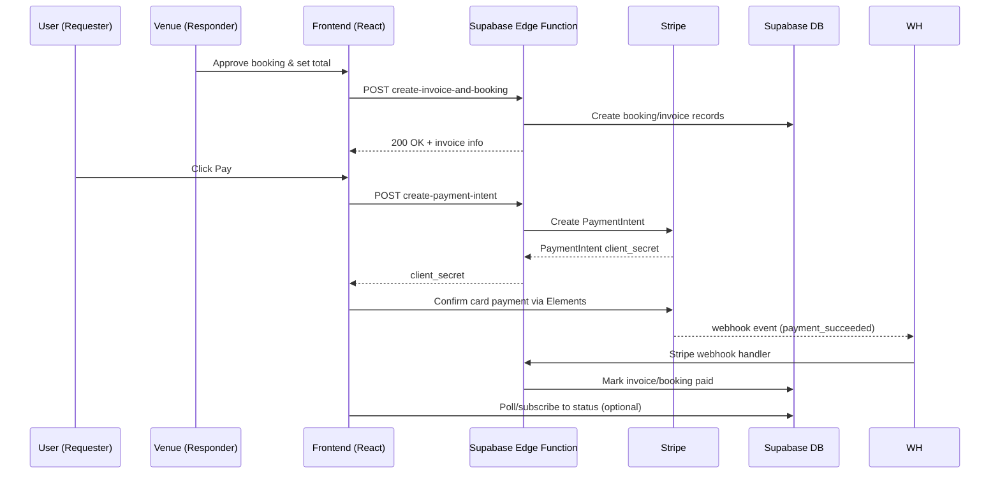
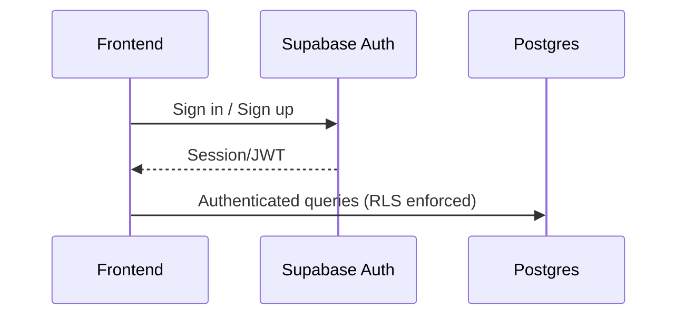

# System Architecture

This document summarizes the overall architecture, tech stack, and key flows for the Splitspace web app.

## Overview
- __Frontend__: React 18 + TypeScript, built with Vite.
- __Backend/BaaS__: Supabase (Postgres, Auth, Edge Functions).
- __Payments__: Stripe (Elements, Payment Intents, Webhooks, Connect features).
- __Tax Rates__: TaxRate.io via Supabase Edge Function proxy.
- __Email/Notifications__: Brevo (via Supabase Edge Function).
- __Deployment__: Netlify.
- __Testing/QA__: Jest + Testing Library, Playwright, Percy.

## Frontend
- __Framework__: React 18 + TypeScript.
- __Build Tool__: Vite.
- __Routing__: `react-router-dom`.
- __UI & A11y__: Tailwind CSS v4, Flowbite/Flowbite-React, `lucide-react` icons, `react-aria`/`react-aria-components` for accessible components.
- __Maps__: Leaflet via `react-leaflet`.
- __File Handling__: `react-dropzone`, `browser-image-compression`, `file-saver`.
- __Markdown__: EasyMDE via `react-simplemde-editor`, parsing with `marked`.
- __Env Access__: `import.meta.env` via Vite, helper in `src/lib/env.ts`.

Key paths:
- Entry/HTML: `index.html`
- Vite config: `vite.config.ts`
- App source: `src/`
- Supabase client: `src/lib/supabase.ts`
- Auth context: `src/contexts/AuthContext.tsx`
- Payments UI: `src/components/payment/PaymentForm.tsx`, `src/pages/PaymentConfirmationPage.tsx`
- Messaging/approvals: `src/components/messaging/MessageThread.tsx`

## Backend (Supabase)
- __Database__: PostgreSQL managed by Supabase.
  - Migrations: `supabase/migrations/`
- __Auth__: Supabase Auth (Gotrue).
- __Edge Functions__: TypeScript functions deployed via Supabase.
  - Examples:
    - `supabase/functions/create-payment-intent/` (creates Stripe PaymentIntent)
    - `supabase/functions/stripe-webhook/` (handles Stripe webhook events)
    - Other helpers: `booking-payout-breakdown/`, `cancel-booking/`, `create-express-account-link/`, etc.
- __Config__: `supabase/config.toml`

## Payments (Stripe)
- __Libraries__: `@stripe/react-stripe-js`, `@stripe/stripe-js` on the client.
- __Server side__: Edge Functions call Stripe API with server-side keys.
- __Webhooks__: `supabase/functions/stripe-webhook/` to confirm payment status and update DB.
- __Refund policy__: Stripe does not return original processing fees on refunds; some methods may add refund fees per agreement.

## Tax Rates (TaxRate.io)
- __Provider__: TaxRate.io.
- __Access__: The frontend calls a Supabase Edge Function proxy which in turn queries TaxRate.io. This keeps the TaxRate.io API key off the client.
- __Client utility__: `src/utils/taxrate.ts` exports `getTaxRateByZip(zip)` which POSTs to the proxy (`/functions/v1/taxrate-proxy`) with the Supabase anon key for authorization.
- __Usage__: Used to fetch and apply sales tax rates for properties based on ZIP code.

## Deployment
- __Platform__: Netlify.
- __Config__: `netlify.toml`.
- __Build__: `vite build`.

## Testing & QA
- __Unit__: Jest + Testing Library (`src/__tests__/`, `jest.config.mjs`).
- __E2E/Visual__: Playwright (`playwright.config.ts`, `tests/visual/`) + Percy (`@percy/cli`, `@percy/playwright`).
- __Coverage__: Jest coverage artifacts in `coverage/`.

## Email & Notifications (Brevo)
- __Provider__: Brevo (formerly SendinBlue).
- __Flow__: Frontend calls Supabase Edge Function `send-notification` with a user session token; the edge function uses Brevo API to send templated emails.
- __Client helper__: `src/lib/notifications.ts` provides `sendNotification(...)`, formats data, ensures idempotency (via `sent_notifications` table), and calls the edge function.
- __Templates__: Notification `type` maps to Brevo templates (e.g., message_received, booking_confirmed, payment_received, new_inquiry).
- __Config__: Requires Brevo API key and Supabase settings. Client checks `VITE_BREVO_API_KEY`; edge function should be configured with secure server-side key.

## Environment & Configuration
- __Env file__: `.env.example` as reference.
- __Vite env__: `VITE_*` variables used throughout (e.g., Supabase URL, Stripe keys public side).
- __Docs__: Additional guides under project root (e.g., `STRIPE_WEBHOOK_SETUP.md`, `WEBHOOK_TESTING.md`).

## Component Diagram (High level)
```mermaid
flowchart LR
  subgraph Client [Frontend (Browser)]
    A[React App\nVite build]
    B[Stripe Elements]
  end
  subgraph Supabase [Supabase]
    DB[(Postgres)]
    AUTH[Auth]
    EF[Edge Functions]
  end
  subgraph Stripe [Stripe]
    PI[Payment Intents]
    WH[Webhooks]
  end
  Netlify[Netlify Hosting]

  A -- fetch --> EF
  A -- query/mutate --> DB
  A -- auth --> AUTH
  A -- Elements --> B
  EF -- server-side API --> PI
  WH -- events --> EF
  EF -- update --> DB
  Netlify --- A
```

## Key Flows

### 1) Booking Approval → Invoice Creation → Payment


### 2) Authentication


## Row Level Security (RLS)
- __Profiles table (`public.profiles`)__:
  - Authenticated-only reads: `SELECT` allowed for `authenticated` role.
  - Self-CRUD: users may `INSERT/UPDATE/DELETE` only their own row (`auth.uid() = id`).
  - Admin overrides: policies rely on `public.auth_is_admin()` which reads `request.jwt.claims.is_admin` and grants read/update on any profile for admins.
- __Admin claim__: `public.auth_is_admin()` is a stable SQL function that does not query tables (avoids recursion). Ensure your JWT includes `is_admin: true` for admin users.
- __Avoiding recursion__: Policies on `profiles` must not `SELECT FROM profiles` or from tables whose policies reference `profiles` (e.g., `properties`, `inquiries`). Use JWT claims or purpose-built mapping tables/views instead.
- __Public data__: If public pages need limited profile fields (e.g., `full_name`, `avatar_url`), expose a view like `public.profiles_public_view` and grant `SELECT` on that view, keeping the base table authenticated-only. This is optional and currently deferred.

Migrations implementing this model:
- `supabase/migrations/20250905060000_fix_profiles_recursive_policies.sql`
- `supabase/migrations/20250905061000_profiles_auth_read_jwt_admin.sql`

## Notable Files
- `src/components/messaging/MessageThread.tsx`: Booking approval, invoice request, payment prompts.
- `src/pages/PaymentConfirmationPage.tsx`: Payment confirmation UI and state handling.
- `supabase/functions/create-payment-intent/index.ts`: Creates Stripe PaymentIntent.
- `supabase/functions/stripe-webhook/index.ts`: Handles Stripe webhook events and updates state.
- `supabase/functions/send-notification/index.ts`: Sends emails through Brevo based on notification type.
- `src/lib/notifications.ts`: Client library to trigger Brevo notifications via the edge function.
- `src/utils/taxrate.ts`: Client helper to fetch tax rates via the Supabase Edge Function proxy to TaxRate.io.
- `supabase/migrations/`: Database schema changes.
- `netlify.toml`: Build/deploy settings.

## Observability & Logging
- Client console logs during payment and approval flows.
- Edge Functions log to Supabase function logs (view via CLI/UI).

## Future Enhancements
- Improve integration tests using real `loadStripe()` in tests.
- Add centralized logging/telemetry for Edge Functions.
- Document booking cancellation and payout schedules in more detail.
